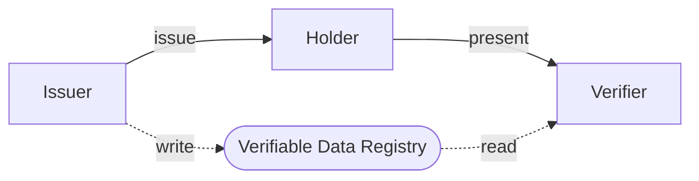

# Verifiable Credentials

> Verifiable credentials (VCs) are an open standard for digital credentials. They can represent information found in physical credentials, such as a passport or license, as well as new things that have no physical equivalent, such as ownership of a bank account. They have numerous advantages over physical credentials, most notably that they're digitally signed, which makes them tamper-resistant and instantaneously verifiable. Verifiable credentials can be issued by anyone, about anything, and can be presented to and verified by everyone. The entity that generates the credential is called the Issuer. The credential is then given to the Holder who stores it for later use. The Holder can then prove something about themselves by presenting their credentials to a Verifier.
> &mdash; <cite>[wikipedia][1]</cite>



## Trust Model

- Issuer trusts Holder
- Holder trusts verifier
- Verifier trusts Issuer
- Holder mediates between Issuer and Verifier

### Holder

- manages credentials
- uses credentials to create presentations of proof

### Issuer

- digitally signs attestations
- packages and gives credentials to Holder

### Verifier

- requests proof
- verifies that issuer attestations satisfy requirements

## Data Model 1.0

### Composition

May be expressed using [[json]]

- Context
- Issuer
- Issue Timestamp
- Expiry Timestamp
- Type
- Subject
- Subject identity attributes
- Cryptographic proof

```JSON
"verifiableCredential": {
    "@context": [
        "https://www.w3.org/2018/credentials/v1",
        "https://www.w3.org/2018/credentials/examples/v1"
    ],
    "id": "0892f680-6aeb-11eb-9bcf-f10d8993fde7",
    "type": [
        "VerifiableCredential",
        "UniversityDegreeCredential"
    ],
    "issuer": {
         "id": "did:example:76e12ec712ebc6f1c221ebfeb1f",
         "name": "Acme University"
    },
    "issuanceDate": "2021-05-11T23:09:06.803Z",
    "credentialSubject": {
        "id": "did:example:ebfeb1f712ebc6f1c276e12ec21",
        "degree": {
            "type": "BachelorDegree",
            "name": "Bachelor of Science"
        }
    },
    "proof": {
        "type": "Ed25519Signature2018",
        "created": "2021-05-17T15:25:26Z",
        "jws": "eyJhbGciOiJFZERTQYjY0Il19..nlcAA",
        "proofPurpose": "assertionMethod",
        "verificationMethod": "https://pathToIssuerPublicKey"
    }
}
```

### Aliases

The context, defined by the `@context` property, is a [[json-ld]] construct that allows user friendly terms to be used for [[json]] properties. The data model requires the value of many properties to be a [[uri]] which are globally unambiguous but not user friendly.

### Subject

The holder of the VC does not always have to be the subject of the credential, but in many cases the holder and the subject will be the same entity

### Proofs

No proof mechanism is standardized, but the data model is flexible enough to support existing [[cryptography]] mechanisms.
Existing examples:

- [[digital-signatures]]
- [[jwt]] with [[jws]]
- [[json-ld]] proofs
- [[zero-knowledge-proof]]

## Decentralized Identifiers

[[did]]s are globally unique and publically accessible (typically stored on a blockchain)

## Verifiable Presentations

Data derived from [[verifiable-credentials]] that is shared with a verifier

## Problems with traditional verification systems

[Verifiable Credentials: The Ultimate Guide](https://blog.dock.io/verifiable-credentials/)

- Proving authenticty of documents is slow
- Increased risk of breaches of concentrated storage of user data
- Paper and digital credentials are easy to forge
- Users don't have control of their data
- Existing credentials disclose more information than necessary when presented for verification

- [1]: https://en.wikipedia.org/wiki/Verifiable_credentials

[//begin]: # "Autogenerated link references for markdown compatibility"
[json]: json "JSON (JavaScript Object Notation)"
[json-ld]: json-ld "JSON-LD (JavaScript Object Notation for Linked Data)"
[uri]: uri "URI (Uniform Resource Identifier)"
[cryptography]: cryptography "Cryptography"
[digital-signatures]: digital-signatures "digital-signatures"
[jwt]: jwt "JWT (JSON Web Token)"
[jws]: jws "JSW (JSON Web Signature)"
[zero-knowledge-proof]: zero-knowledge-proof "Zero-knowledge Proof"
[did]: did "DID (Decentralized Identifier)"
[verifiable-credentials]: verifiable-credentials "Verifiable Credentials"
[//end]: # "Autogenerated link references"
